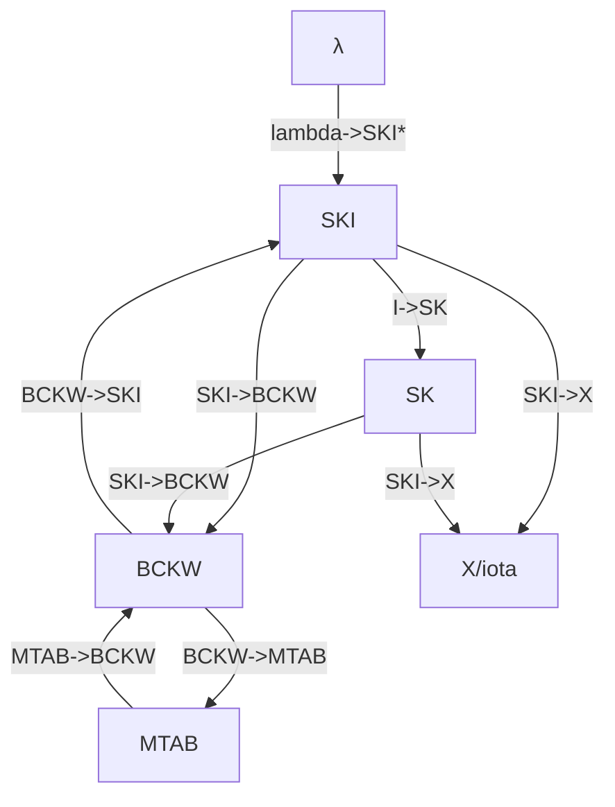

# Combinator Playground

An interpreter for [Combinatory logic](https://en.wikipedia.org/wiki/Combinatory_logic) with a few additional features.

## Usage

The intended usage is from a Clojure REPL. With [Leiningen](https://leiningen.org/) installed, a REPL can be started with `lein repl`. Alternatively use an integration into your favorite editor to evaluate expressions.

```clojure
;; reduce KIxy (returns a vector of intermediate results)
(reduce* SKI '(K I x y))

;; convert λx.λy.y to SKI and then to BCKW calculus
(-> '[x [y y]] lambda->SKI* last SKI->BCKW)

;; perform a brute force search for all BCKW terms of size 3 that are equivalent to I
(search BCKW 3 ['x] (partial = 'x) 10)
```

## Features

For function documentation, check the docstrings, either in the source code or with `(doc fn)`.
- `reduce*` reduce an expression using the given combinators with intermediate results ([reduce.clj](src/combinator_playground/reduce.clj))
- `lambda->SKI*` convert lambda to SKI calculus ([lambda.clj](src/combinator_playground/lambda.clj))
- `SKI->BCKW`, ... convert between combinators ([combinators.clj](src/combinator_playground/combinators.clj))
- `search` search for expressions ([search.clj](src/combinator_playground/search.clj))

The following graph shows the implemented conversions.


# See also

- https://dallaylaen.github.io/ski-interpreter/quest.html (solutions for some quests are in [quests.clj](src/combinator_playground/quests.clj))
