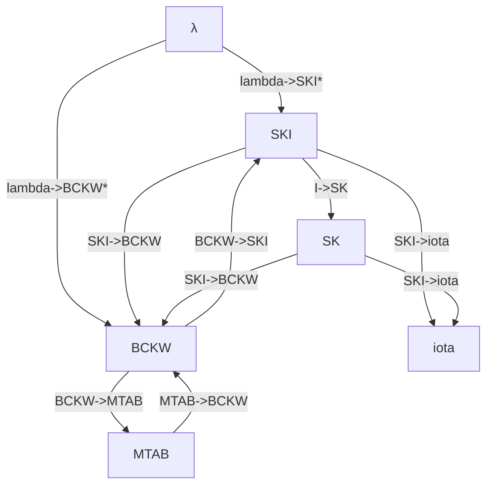

# Combinator Playground

An interpreter for [Combinatory logic](https://en.wikipedia.org/wiki/Combinatory_logic) with a few additional features.

## Usage

The intended usage is from a Clojure REPL. With [Leiningen](https://leiningen.org/) installed, a REPL can be started with `lein repl`. Alternatively use an integration into your favorite editor to evaluate expressions.

```clojure
;; reduce KIxy (returns a vector of intermediate results)
(reduce* SKI '(K I x y))

;; convert λx.λy.y to SKI and then to BCKW calculus
(-> '[x [y y]] lambda->SKI* last SKI->BCKW)

;; perform a brute force search for all BCKW terms of size 3 that are equivalent to I
(search BCKW 3 ['x] (partial = 'x) 10)
```

## Features

For function documentation, check the docstrings, either in the source code or with `(doc fn)`.
- `reduce*` reduce an expression using the given combinators with intermediate results ([reduce.clj](src/combinator_playground/reduce.clj))
- `lambda->SKI*`, `lambda->BCKW*`, `lambda->SKIBC*`, `lambda->SKIBC'*` convert lambda to SKI/BCKW calculus ([lambda.clj](src/combinator_playground/lambda.clj))
- `SKI->BCKW`, ... convert between combinators ([combinators.clj](src/combinator_playground/combinators.clj))
- `search` search for expressions ([search.clj](src/combinator_playground/search.clj))

<details>
<summary>Builtin combinators</summary>

This table was generated with [combinators->md](src/combinator_playground/combinators.clj), the equivalent SKI/BCKW terms are not guaranteed to be short/efficient.

Symbols | Function Abstraction | SKI | BCKW
---|---|---|---
`A` | λa.λb.b | `(K ((S (S (K S) (S (K K) S)) (K K)) K (S (S (K S) (S (K K) S)) (K K))))` | `(K (C K C))`
`B'`, `D` | λa.λb.λc.λd.(a b (c d)) | `((S (K S) K) (S (K S) K))` | `(B B)`
`B1`, `B₁` | λa.λb.λc.λd.(a (b c d)) | `(((S (K S) K) (S (K S) K)) (S (K S) K))` | `((B B) B)`
`B2`, `B₂` | λa.λb.λc.λd.λe.(a (b c d e)) | `(((S (K S) K) (S (K S) K)) (((S (K S) K) (S (K S) K)) (S (K S) K)))` | `((B B) ((B B) B))`
`B3`, `B₃` | λa.λb.λc.λd.(a (b (c d))) | `((S (K S) K) ((S (K S) K) (S (K S) K)) (S (K S) K))` | `(B (B B) B)`
`B` | λa.λb.λc.(a (b c)) | `(S (K S) K)` | `B`
`C'` | λa.λb.λc.λd.(a (b d) c) |  |
`C**` | λa.λb.λc.λd.λe.(a b c e d) | `((S (K S) K) ((S (K S) K) (S (S (K S) (S (K K) S)) (K K))))` | `(B (B C))`
`C*` | λa.λb.λc.λd.(a b d c) | `((S (K S) K) (S (S (K S) (S (K K) S)) (K K)))` | `(B C)`
`C` | λa.λb.λc.(a c b) | `(S (S (K S) (S (K K) S)) (K K))` | `C`
`D1`, `D₁` | λa.λb.λc.λd.λe.(a b c (d e)) | `((S (K S) K) ((S (K S) K) (S (K S) K)))` | `(B (B B))`
`D2`, `D₂` | λa.λb.λc.λd.λe.(a (b c) (d e)) | `(((S (K S) K) (S (K S) K)) ((S (K S) K) (S (K S) K)))` | `((B B) (B B))`
`E` | λa.λb.λc.λd.λe.(a b (c d e)) | `((S (K S) K) (((S (K S) K) (S (K S) K)) (S (K S) K)))` | `(B ((B B) B))`
`F**` | λa.λb.λc.λd.λe.(a b e d c) | `((S (K S) K) ((S (K S) K) ((S (K S) K) (S (S (K S) (S (K K) S)) (K K))) (((S (K S) K) (S (S (K S) (S (K K) S)) (K K))) ((S (K S) K) (S (S (K S) (S (K K) S)) (K K))))))` | `(B (B (B C) ((B C) (B C))))`
`F*` | λa.λb.λc.λd.(a d c b) | `((S (K S) K) ((S (K S) K) (S (S (K S) (S (K K) S)) (K K))) (((S (K S) K) (S (S (K S) (S (K K) S)) (K K))) ((S (K S) K) (S (S (K S) (S (K K) S)) (K K)))))` | `(B (B C) ((B C) (B C)))`
`F` | λa.λb.λc.(c b a) | `(((S (K S) K) (((S (K S) K) (S (K S) K)) (S (K S) K))) ((S (S (K S) (S (K K) S)) (K K)) I) ((S (S (K S) (S (K K) S)) (K K)) I) ((S (K S) K) (((S (K S) K) (S (K S) K)) (S (K S) K))) ((S (S (K S) (S (K K) S)) (K K)) I))` | `((B ((B B) B)) (C (W K)) (C (W K)) (B ((B B) B)) (C (W K)))`
`G` | λa.λb.λc.λd.(a d (b c)) | `(((S (K S) K) (S (K S) K)) (S (S (K S) (S (K K) S)) (K K)))` | `((B B) C)`
`H` | λa.λb.λc.(a b c b) | `((S (K S) K) (S S (K I)) ((S (K S) K) (S (S (K S) (S (K K) S)) (K K))))` | `(B W (B C))`
`I*` | λa.λb.(a b) | `(S (S K))` | `((B (B W) (B B C)) ((B (B W) (B B C)) K))`
`I` | λa.a | `I` | `(W K)`
`J` | λa.λb.λc.λd.(a b (a d c)) |  |
`K` | λa.λb.a | `K` | `K`
`L` | λa.λb.(a (b b)) | `((S (S (K S) (S (K K) S)) (K K)) (S (K S) K) (S I I))` | `(C B (W (C K C)))`
`M2`, `M₂` | λa.λb.(a b (a b)) |  |
`M` | λa.(a a) | `(S I I)` | `(W (C K C))`
`N` | λa.λb.λc.λd.(a b (c b d)) |  |
`O` | λa.λb.(b (a b)) | `(S I)` | `((B (B W) (B B C)) (W K))`
`PHI`, `S'`, `Φ` | λa.λb.λc.λd.(a (b d) (c d)) | `((((S (K S) K) (S (K S) K)) (S (K S) K)) S (S (K S) K))` | `(((B B) B) (B (B W) (B B C)) B)`
`PSI`, `Ψ` | λa.λb.λc.λd.(a (b c) (b d)) | `((S (K S) K) (S ((((S (K S) K) (S (K S) K)) (S (K S) K)) S (S (K S) K)) (S (S (K S) (S (K K) S)) (K K)) (S (K S) K)) (S (K S) K))` | `(B ((B (B W) (B B C)) (((B B) B) (B (B W) (B B C)) B) C B) B)`
`Q1`, `Q₁` | λa.λb.λc.(a (c b)) | `((S (K S) K) (S (S (K S) (S (K K) S)) (K K)) (S (K S) K))` | `(B C B)`
`Q2`, `Q₂` | λa.λb.λc.(b (c a)) | `((S (S (K S) (S (K K) S)) (K K)) ((S (K S) K) (S (S (K S) (S (K K) S)) (K K)) (S (K S) K)))` | `(C (B C B))`
`Q3`, `Q₃` | λa.λb.λc.(c (a b)) | `((S (K S) K) ((S (S (K S) (S (K K) S)) (K K)) I))` | `(B (C (W K)))`
`Q4`, `Q₄` | λa.λb.λc.(c (b a)) | `(((S (K S) K) ((S (K S) K) (S (S (K S) (S (K K) S)) (K K))) (((S (K S) K) (S (S (K S) (S (K K) S)) (K K))) ((S (K S) K) (S (S (K S) (S (K K) S)) (K K))))) (S (K S) K))` | `((B (B C) ((B C) (B C))) B)`
`Q` | λa.λb.λc.(b (a c)) | `((S (S (K S) (S (K K) S)) (K K)) (S (K S) K))` | `(C B)`
`R**` | λa.λb.λc.λd.λe.(a b d e c) | `((S (K S) K) (((S (K S) K) (S (S (K S) (S (K K) S)) (K K))) ((S (K S) K) (S (S (K S) (S (K K) S)) (K K)))))` | `(B ((B C) (B C)))`
`R*` | λa.λb.λc.λd.(a c d b) | `(((S (K S) K) (S (S (K S) (S (K K) S)) (K K))) ((S (K S) K) (S (S (K S) (S (K K) S)) (K K))))` | `((B C) (B C))`
`R` | λa.λb.λc.(b c a) | `(((S (K S) K) (S (K S) K)) ((S (S (K S) (S (K K) S)) (K K)) I))` | `((B B) (C (W K)))`
`S` | λa.λb.λc.(a c (b c)) | `S` | `(B (B W) (B B C))`
`T` | λa.λb.(b a) | `((S (S (K S) (S (K K) S)) (K K)) I)` | `(C (W K))`
`U` | λa.λb.(b (a a b)) | `(((S (S (K S) (S (K K) S)) (K K)) (S (K S) K) (S I I)) (S I))` | `((C B (W (C K C))) ((B (B W) (B B C)) (W K)))`
`V**` | λa.λb.λc.λd.λe.(a b e c d) |  |
`V*` | λa.λb.λc.λd.(a c b d) |  |
`V` | λa.λb.λc.(c a b) | `((S (K S) K) (S (S (K S) (S (K K) S)) (K K)) ((S (S (K S) (S (K K) S)) (K K)) I))` | `(B C (C (W K)))`
`W**` | λa.λb.λc.λd.(a b c d d) | `((S (K S) K) ((S (K S) K) (S S (K I))))` | `(B (B W))`
`W*` | λa.λb.λc.(a b c c) | `((S (K S) K) (S S (K I)))` | `(B W)`
`W1`, `W¹` | λa.λb.(b a a) | `((S (S (K S) (S (K K) S)) (K K)) (S S (K I)))` | `(C W)`
`W` | λa.λb.(a b b) | `(S S (K I))` | `W`
`iota`, `ι` | λa.(a S K) |  |
`Ê` | λa.λb.λc.λd.λe.λf.λg.(a (b c d) (e f g)) | `(((S (K S) K) (((S (K S) K) (S (K S) K)) (S (K S) K))) ((S (K S) K) (((S (K S) K) (S (K S) K)) (S (K S) K))))` | `((B ((B B) B)) (B ((B B) B)))`
</details>

The following graph shows some of the directly implemented conversions, more can be derived from the included set of definitions.

```mermaid
graph TD;
    lambda[λ]-->|lambda->SKI*|SKI;
    lambda[λ]-->|lambda->BCKW*|BCKW;
    SKI-->|I->SK|SK;
    SKI-->|SKI->BCKW|BCKW;
    SK-->|SKI->BCKW|BCKW;
    SKI-->|SKI->iota|iota;
    SK-->|SKI->iota|iota;
    BCKW-->|BCKW->SKI|SKI;
    MTAB-->|MTAB->BCKW|BCKW;
    BCKW-->|BCKW->MTAB|MTAB;
```

# See also

- https://dallaylaen.github.io/ski-interpreter/quest.html (solutions for some quests are in [quests.clj](src/combinator_playground/quests.clj))
- https://blog.happyfellow.dev/a-riddle/ ([riddle.txt](resources/riddle.txt) and a solution in [riddle.clj](src/combinator_playground/riddle.clj))
- https://combinatorylogic.com/table.html
